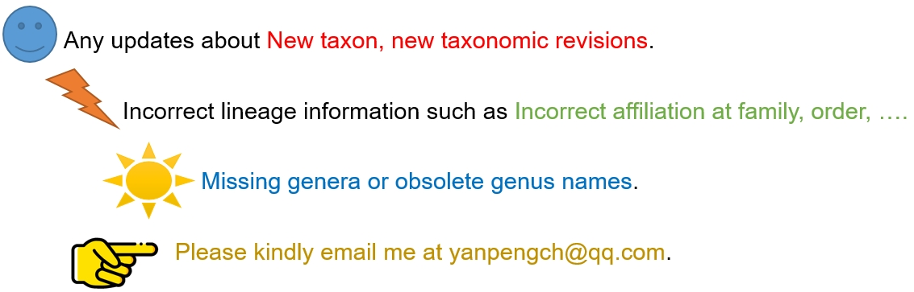

# fungioutline
**fungioutline**—a tiny R package that integrates up-to-date taxonomy with public genomes for phylogenomic analysis.


## Updates
2025.20 updated classes
## Install
```
library(devtools)
devtools::install_github(""ypchan/fungioutline)
```
## Usage
1. Load and take a look at the outline
```
library(fungioutline)
head(outline)
```

2. Update outline
   
First, update data/outline.<update>.xlsx

3. Summary

- Count all taxonomic levels
   ```
   outline %>%
     summarise(across(c(Kingdom, Subkingdoms, Phyla, Subphyla,Classes,Subclasses,Orders,Families,Genera), ~length(unique(.))))
   ```
- Count by group names
  ```
  outline %>%
    filter(Classes == "Sordariomycetes") %>%
    summarise(across(c(Subclasses,Orders,Families,Genera), ~length(unique(.))))
  ```
- List by group names
  ```
  outline %>%
    filter(Classes == "Sordariomycetes") %>%
    select(Subclasses, Orders, Familes, Genera)
  ```
- Validate taxonomic names
  ```
  # first check the suffixes, for most taxon
  # family - aceae
  # order - ales
  # class - mycetes
  # subclass - mycetidae
  # subphyla - mycotina
  # phyla - mycota
  ## to validate a family name: Septochytriaceae
  outline %>% filter(Families == "Septochytriaceae")
  ## To validate a genus name: Periconia
  outline %>% filter(Genera == "Periconia")
  ```

- Assign lineage information to a table by taxa name at different levels.
  ```
  # Assign lineage information from family to phyla
  outline %>%
    select(Kingdom, Subkingdoms, Phyla, Subphyla,Classes,Subclasses,Orders,Families,Genera) -> lineage_tbl
  
  tbl_to_assign_by_genera_name %>%
    left_join(lineage_tbl, by = c("Genus" = "Genera")) -> assigned_tbl
  write_xlsx(assigned_tbl, "assigned_tbl.xlsx")
  ```
## References
1. 2024: The 2024 Outline of Fungi and fungus-like taxa. [link](https://mycosphere.org/pdf/MYCOSPHERE_15_1_25.pdf)
2. 2023: Phylogenomics and diversification of Sordariomycetes. [link](https://mycosphere.org/pdf/MYCOSPHERE_14_1_5.pdf)
3. 2021: A genome-scale phylogeny of the kingdom Fungi. [link](https://doi.org/10.1016/j.cub.2021.01.074)
4. ....

  
  
   
